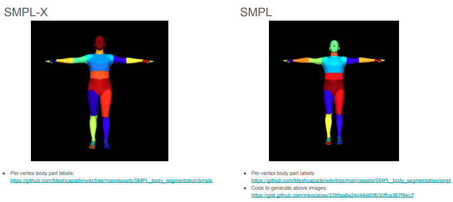
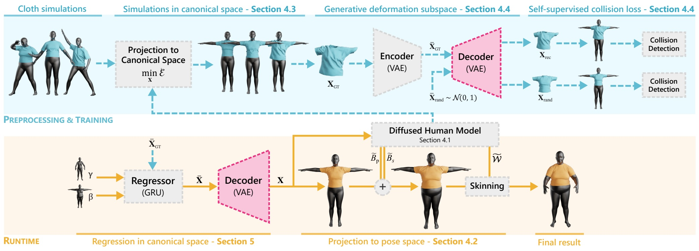
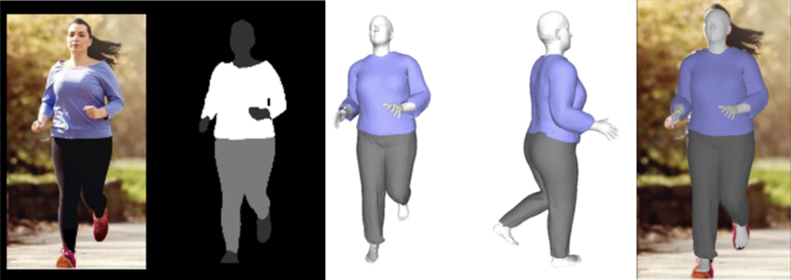
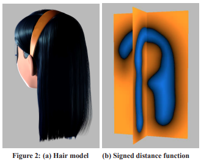
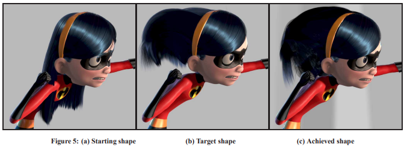

# Digital human clothing project

## Introduction
A project to dress a human character mesh created with RGB video using physics simulation.

## Requirements (Recommended)
- Python 3.8
- Ubuntu 20.04
- CUDA 12
- PyTorch 2.1.0
- Taichi 1.6.0

For other settings, please refer to the README.md file.

## Problems
The current human character mesh from deep learning model is not stable enough to be used in physics simulation.
There are two major issues currently being considered:
1. **Zittering**

In the case of zittering, the tremor is transmitted directly to the clothes, resulting in unstable movement.
As impacts are steadily applied to cloth, friction decreases and eventually causes clothes to gradually peel off.

2. **Occluded body parts**

If part of the body is obscured in the video, this cannot be handled perfectly due to the nature of the model, which only uses RGB data.
The deep learning model ultimately creates large, non-continuous movements of the character between frames in the occluded areas, which causes problems in finding collision pairs in physics simulation.
This causes the clothes to dig into the body rather than maintaining a stable collision relationship with the character.

3. **Interpenetration**

Currently, the model SMPL has a problem that it is not possible to prevent interpenetration between the body parts of the character.
But this problem is not a big problem because it can be solved by using the legendary collision detection method, untangling cloth [Baraff et al. 2003].
(https://dl.acm.org/doi/pdf/10.1145/882262.882357)

These issues cause characters to be unable to wear clothes reliably. 

## Existing methods
- **CCD (Continous Collision Detection)**

CCD is a method of detecting collisions between objects by checking the trajectory of the object between frames.
Current thinking is that CCD cannot use perfect time steps, so character movement must be limited. 
However, in the current situation, this method is not appropriate because character information is determined by model output.

- **Velocity correction**

Velocity correction is a method of correcting the velocity of an object when a collision occurs. 
This method is used to prevent objects from penetrating each other when a collision occurs.
However, this method is not appropriate for the current situation because it is not possible to determine the collision pair between the character and the clothes.

## Solution
1. **Use segmented body parts to track collision pairs**

SMPL model gives us the segmentation of the body parts, so we can use this information to track the collision pairs between the character and the clothes.

The reason why I came up with this thought is because there is already a papers that solved this problem using deep learning...

https://mslab.es/projects/SelfSupervisedGarmentCollisions/

https://liren2515.github.io/page/dig/dig.html

Many papers have already presented methods for reconstructing clothes using deep learning, and I thought I could get an idea to control conflict of ideas through the objective function involved in learning.

2. **SDF collision detection**

If we can generate SDF (Signed Distance Field) of the character, we can use this information to detect collision between the character and the clothes.
I don't know how difficult it would be to implement sdf since we are already using spacial hashing techniques for collision detection.
However, looking at it positively, it does not seem impossible to implement...

https://graphics.pixar.com/library/Hair/paper.pdf

PIXAR research team used SDF to detect collision between hair and body. It would be great if I could use this idea.

3. **Make tetrahedral mesh of the character**

If we can make tetrahedral mesh of the character, we can use this information to detect collision between the character and the clothes.
Since the important thing is to maintain collision pairs and keep clothes from digging into the body, I thought I would need something similar to SDF that could push the clothes out of the body. 
However, this method seems very difficult.